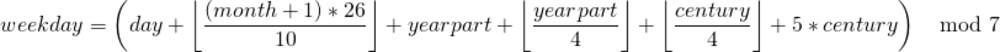

## Mini Programming Challenge #05 (Due Date 03/30)

This mini-challenge is about getting you comfortable with the autograder and basic C++ arethmatic operations. **Arrays, functions, and loops are not allowed. The only libraries allowed for this assignment are `<iostream>` and `<iomanip>`**.  Mini-challenge problemsets are to be completed individually. You are not allowed to share your code with other students. The assignment is worth a total of 100 points. If you have any questions or need any help, please visit us during office hours and/or post questions on Piazza.

> If you need to post any of your actual source code on Piazza for any reason, **please** be sure to tag the post as being _visible to instructors only_, so that you don't inadvertently share code with others and violate class rules.

### Format details
Your submission will be tested and graded by an autograder, for this reason it cannot be stressed enough that your program must exactly follow the specifications for input and output upon submission.

If the question specifies that it will take a `double` then a `char` you must follow this input order or else fail the test.  For this assignment, you should use the `int` data type for regular whole numbers and as the default when a number format is not specified, you should use the `double` data type for any question which specifies decimal or floating point numbers, and `char` for single letter variables or input.

The output will always be some form of string printed out on a single line. It will always begin on a new line and end with some form of newline character; either `std::endl` or `'\n'`.  Whenever printing a `double` you should always have exactly 4 decimal places; if your decimal number is `3.1415926534`, you should print it as `3.1416`. If your number is `0.0` or `0`, it should print as `0.0000`. You can use `<iomanip>` to accomplish this.

For details on expected submission instructions, please refer to the **Submission and Grading** section at the bottom of the document.

1. *Temperature converter*. This program should prompt the user for two arguments, first a _decimal_  number and second, a single letter, either `C` or `F`. The decimal represents a temperature, the character represents which system that degree is in (`50.0` `F` would be 50.0 degrees Fahrenheit etc.). This program should take the given number and convert it to a temperature in the other system. The output string format should be `<input num> degree(s) <input system> is equal to <new num> degree(s) <other system>`. Eg. input `0` `C` would give the string `0.0000 degree(s) C is equal to 32.0000 degree(s) F`. You can assume that either `F` or `C` will be given for input, no need to account for invalid input.

2. *Grades*. This program should prompt the user for a single character as an argument, this character should represent a letter grade. The program should print a single-line string for each different grade.

    Grade Letter | Output
    --|--
    A | `Excellent`
    B | `Good`
    C | `Average`
    D | `Poor`
    F | `Failing`

Additionally, the case of the letter should _not_ matter. `A`, `a`, `B`, `b`, etc. should all be acceptable input for the program.

3.  *Day of the week*. This program takes in three integers, representing `day` `month` `year` in that order, and should output the day of the week associated with the given date. The formula used to calculate the date is:

   * _day_ is the day of the month (1, 2, 3, etc.).
   * _century_ is equal to (_year_ / 100). For 2019, century would be 20.
   * _yearpart_ is the year within the century (_year_ mod 100). For 2019, year would be 19.
   * _month_ is the month of the year, we typically associate the months as January = 1, February = 2, March = 3, etc. This is the case for this program for all cases **except** for January and February. Due to the way the formula works, specifically January and February must be entered into the above formula as months 13 and 14 of the _previous_ year. This is to say that if you wanted to know which day of the week January 5, 1997 fell on, you would need _month_ = 13, _day_ = 5, _year_ = 1996 when the values enter the formula. Your program should take them in as regular format `5 1 1997` and treat them differently once they have been read.
   * The value _weekday_ resulting from the equation will be a number [0,6] where Saturday = 0, Sunday = 1, etc.

The output of your program should be a single string name of the appropriate weekday. If the formula outputs 0, your output will be `Saturday` and so on.

4. *Triangles*. This program should take as arguments, three interior angles of a triangle (for simplicity we will take only `integer` values for angles), it should classify the triangle as one of the three types of triangles (`Acute`, `Right`, and `Obtuse`) and print that label to the console as output. Additionally, if the triangle given is impossible (sum of interior angles does _not_ equal 180) the program should not print any labels, and should instead print `This triangle is impossible`.

### Submission and Grading
You will submit a single _zip file_ named `mc4.zip` through Gradescope.  Your zip archive must contain your source files **only**.  For each of the problems, create a file called `main_<num>.cpp` where _num_ is the question number itself with no leading zeros. Ensure _all_ of your code resides within the `main()` function within that file.  All programs **must** compile and execute without warnings.  Your programs will be automatically graded.  For each of the questions you either pass the test cases (full points) or not (zero points).

>You must be reminded that students caught cheating or plagiarizing will receive `no credit`. Additional actions, including a failing grade in the class or referring the case for disciplinary action, may also be taken.
